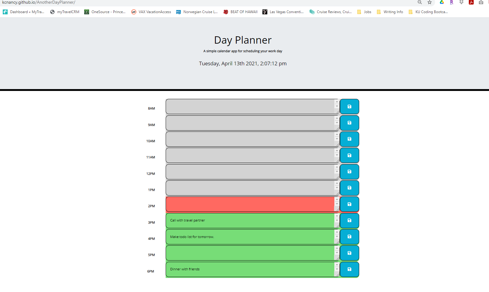

# AnotherDayPlanner
A second version of the day planner exercise

https://kcnancy.github.io/AnotherDayPlanner/
## Table of Contents
* [Description](#description)
* [User Story](#userstory)
* [Development](#development)
* [Usage](#usage)
* [Credits](#credits)
* [License](#license)

## Description -
This is a day planner where the user can input tasks or meetings in the description filed and when the save button is clicked the entry will be saved in local storage. The time of day is provided by the moment.js api. This allows the planner to be updated in color blocks to quickly draw attention to the current hour which displays in red. The hours that have passed are grey and the upcoming hours are green.
Video demo

https://drive.google.com/file/d/1j8APgGGvdrlH1SENzFTCfpRQggZMlcL0/view

## User Story -
AS AN employee with a busy schedule

I WANT to add important events to a daily planner

SO THAT I can manage my time effectively

## Development -
HTML, javascript, bootstrap, moment.js, jquery, googleapis and fontawesome(within bootstrap) were all used to create this planner. I also referenced GeeksforGeeks.org, fontawesome.com, developer.moilla.org, w3schools.com, webdev simplified you tube channel and stackofverflow during the creation of this application.

### Resources -
* https://www.geeksforgeeks.org/
* https://fontawesome.com/
* https://developer.mozilla.org/en-US/docs/Web/API
* https://www.w3schools.com/
* https://www.youtube.com/channel/UCFbNIlppjAuEX4znoulh0Cw
* https://stackoverflow.com/
* https://momentjs.com/
* https://plugins.jquery.com/
* https://getbootstrap.com/

## Usage
The HTML page can be launched from Visual Code and the page will reflect the current day and time foe the workday. The application has also been deployed through Github and can be launched with this link:

https://kcnancy.github.io/AnotherDayPlanner/

Once the day planner is launched you can enter any text in the open text area, hit save to keep the text. If you want to remove the text delete your input and hit save again.

## Credits
Nancy McBride, author

## License
MIT License

Copyright (c) 2021 KU Boot Camp

Permission is hereby granted, free of charge, to any person obtaining a copy
of this software and associated documentation files (the "Software"), to deal
in the Software without restriction, including without limitation the rights
to use, copy, modify, merge, publish, distribute, sublicense, and/or sell
copies of the Software, and to permit persons to whom the Software is
furnished to do so, subject to the following conditions:

The above copyright notice and this permission notice shall be included in all
copies or substantial portions of the Software.

THE SOFTWARE IS PROVIDED "AS IS", WITHOUT WARRANTY OF ANY KIND, EXPRESS OR
IMPLIED, INCLUDING BUT NOT LIMITED TO THE WARRANTIES OF MERCHANTABILITY,
FITNESS FOR A PARTICULAR PURPOSE AND NONINFRINGEMENT. IN NO EVENT SHALL THE
AUTHORS OR COPYRIGHT HOLDERS BE LIABLE FOR ANY CLAIM, DAMAGES OR OTHER
LIABILITY, WHETHER IN AN ACTION OF CONTRACT, TORT OR OTHERWISE, ARISING FROM,
OUT OF OR IN CONNECTION WITH THE SOFTWARE OR THE USE OR OTHER DEALINGS IN THE
SOFTWARE.

